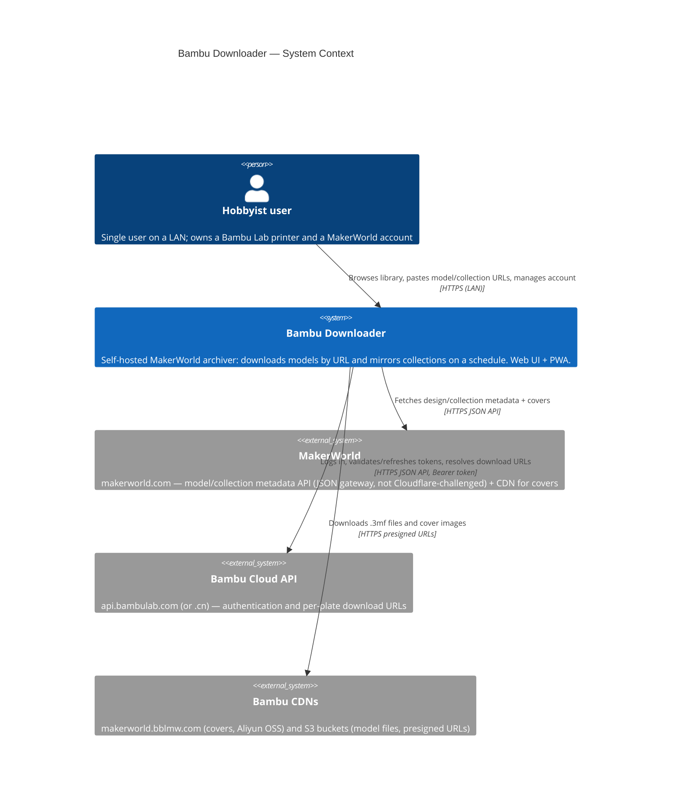
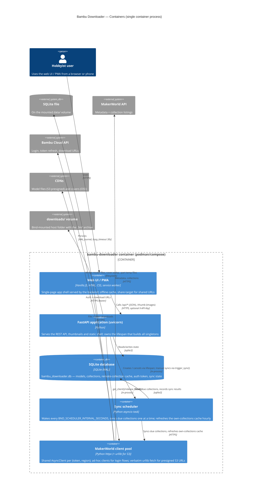
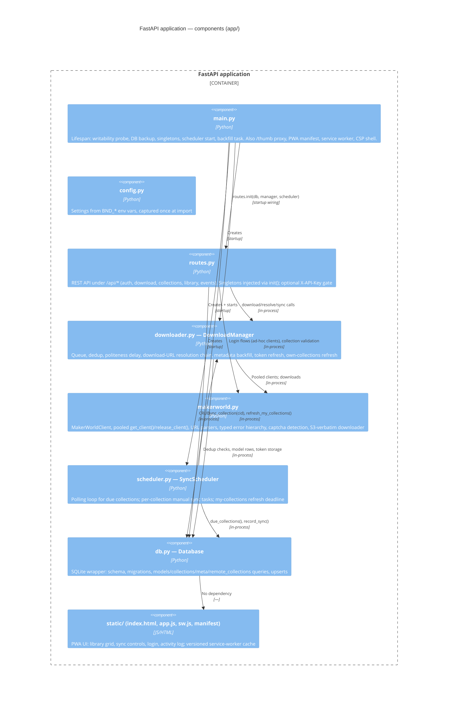
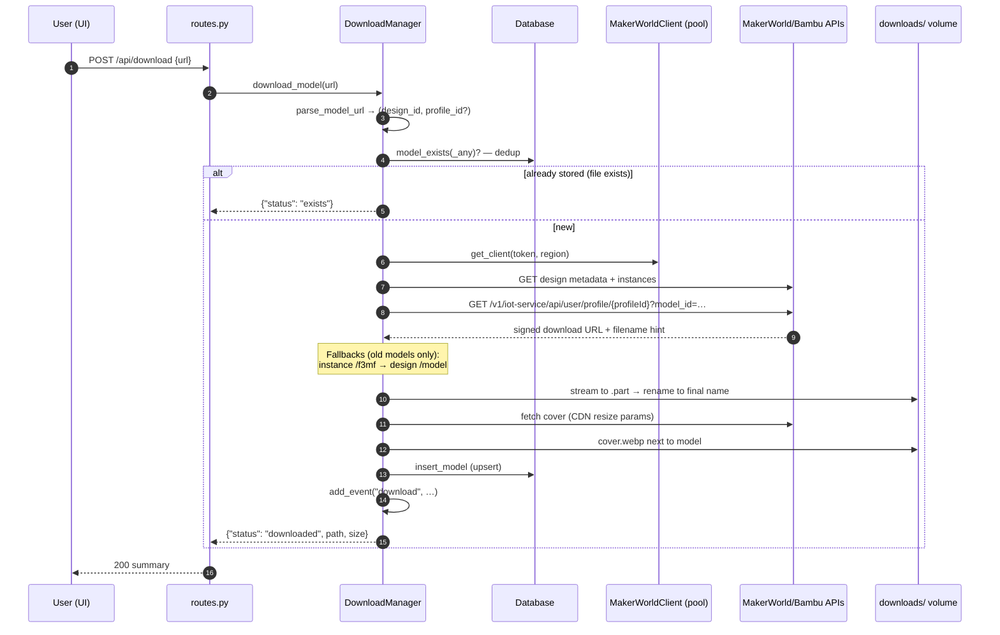
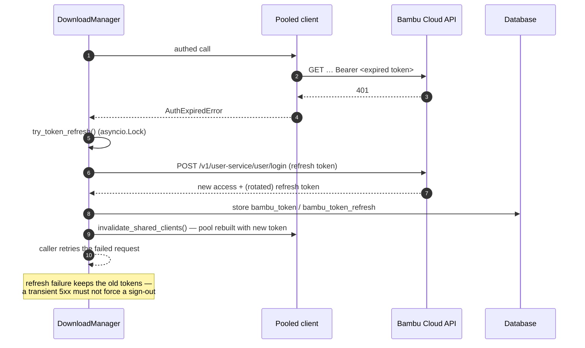
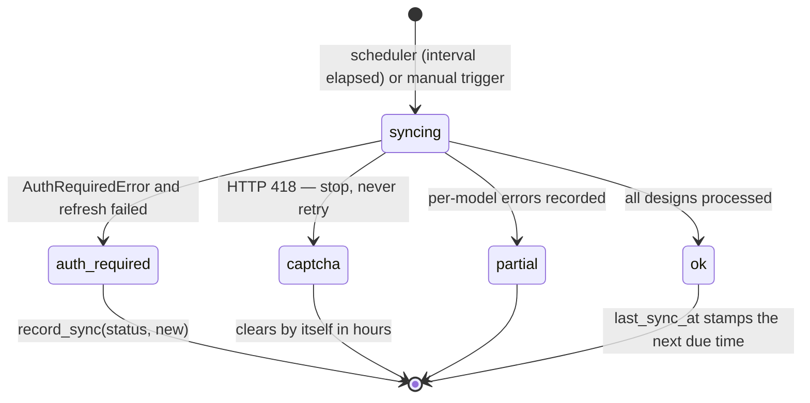

# Architecture — C4 Models

Bambu Downloader is a self-hosted, single-user **archiver for
[MakerWorld](https://makerworld.com)** (Bambu Lab's model sharing platform). It
downloads `.3mf` model files by URL, mirrors whole MakerWorld collections on a
schedule without duplicates, and exposes a small web UI / PWA for managing the
library.

The design goal is **politeness and resilience**: the app talks to Bambu's
APIs with an honest identity, spaces out requests, aborts cleanly on
rate-limiting, and never re-downloads what it already has. State lives in one
SQLite file; models land in a plain folder tree so they are directly usable by
Bambu Studio / a printer.

---

## Level 1 — System Context

> **Purpose**: who uses the system and what external systems it depends on.



**Notes**

- The user is the *only* user: it is a personal, single-tenant system. The
  optional `BND_API_KEY` shared secret protects the API on shared networks.
- MakerWorld's HTML pages sit behind a Cloudflare challenge, but the
  `/api/*` JSON gateway is not — that distinction shapes the whole client
  design (see [`makerworld-integration.md`](makerworld-integration.md)).
- The app never talks to printers. Models are saved to a folder the user can
  sync to a printer via their existing tooling.

---

## Level 2 — Containers

> **Purpose**: the runtime units inside the system and how they communicate.



**Key points**

- **One process, one container.** The FastAPI app, scheduler and client pool
  live in the same asyncio event loop. There is no queue, no workers, no
  message broker — concurrency is bounded by an `asyncio.Semaphore(2)`
  around downloads.
- **SQLite in WAL mode** with a 30 s busy timeout is shared by the API layer,
  scheduler, and the boot-time metadata backfill task without locks.
- The **UI is a PWA shell** served by the backend: no build step, no external
  CDNs; a strict CSP keeps everything self-origin. Covers are proxied through
  `/thumb` because the browser cannot hotlink the CDN (CORS).
- Deployment runs under **rootless podman** with `userns_mode: keep-id` so
  bind-mounted `data/` and `downloads/` stay writable (the Dockerfile bakes a
  matching `BND_UID`).

---

## Level 3 — Components (FastAPI application)

> **Purpose**: the modules inside the Python container and their
> responsibilities. Wiring happens once at startup in
> `app/main.py::lifespan`.



Dependency rule: `main → routes/downloader/scheduler → makerworld, db`.
`routes` imports module-level singletons set by `init()` to avoid import
cycles. `static/` only consumes the HTTP API — it has no Python imports.

### Component responsibilities

| Component | Owns |
| --- | --- |
| `main.py` | Lifespan (probe writable volumes → backup DB → open DB → wire routes → start scheduler → background metadata backfill); `/thumb` proxy with ETag/304; PWA endpoints; CSP headers |
| `config.py` | All `BND_*` settings; 15-minute floors on anti-abuse-sensitive intervals |
| `routes.py` | 18 REST endpoints; API-key gate (`hmac.compare_digest`); auth flows (login/verify/token/logout); path-guarded file deletion |
| `downloader.py` | `DownloadManager`: semaphore-bounded queue, dedup by `(design_id, profile_id)`, download-URL fallback chain, cover saving, event ring buffer, silent token refresh with lock |
| `makerworld.py` | HTTP client(s) keyed on `(token, region)`; login (password → email code / TOTP); endpoint wrappers; error taxonomy (`AuthRequiredError`, `AuthExpiredError`, `ForbiddenError`, `NotFoundError`, `CaptchaError`); `download_file` (httpx CDN / urllib S3-verbatim) |
| `scheduler.py` | Due-collection polling; sequential syncs; my-collections hourly deadline (backdated on restart so a fresh container makes no request); graceful cancellation of manual syncs |
| `db.py` | Schema + idempotent migrations; WAL; NULL-safe unique index; label migration and backfill scan watermarks |

---

## Dynamic views

### Sequence — single model download (POST /api/download)



### Sequence — scheduled collection sync

```mermaid
sequenceDiagram
    autonumber
    participant S as SyncScheduler loop
    participant D as Database
    participant M as DownloadManager
    participant C as MakerWorldClient
    participant MW as MakerWorld APIs

    S->>D: due_collections(now)
    loop for each due collection (sequential)
        S->>S: active[cid] = "syncing" (UI state)
        S->>M: sync_collection(cid)
        M->>C: get_collection_info + list_collection_designs (paged)
        MW-->>M: hits[] with design ids
        loop per design (plates_mode: default | all)
            M->>D: model_exists? — skip downloaded
            M->>M: download_model(url#profileId-N, subfolder=title)
            Note over M: ≥ BND_DOWNLOAD_DELAY_SECONDS (3 s)<br/>between downloads — anti-abuse
        end
        alt AuthRequiredError / CaptchaError
            Note over M: abort whole sync (never hammer);<br/>auth → one silent try_token_refresh() then retry
            M->>D: record_sync(cid, "auth-required"|"captcha", new_so_far)
        else normal end
            M->>D: record_sync(cid, "ok"|"partial", new)
        end
        S->>S: active[cid] = None
    end
    Note over S: every my_collections_refresh_minutes (60):<br/>refresh_my_collections() → remote_collections cache
```

### Sequence — token expiry and silent refresh



### State machine — collection sync outcome



### Data flow — thumbnails

```mermaid
flowchart LR
    UI[app.js img tags] -->|GET /thumb?url=…| TH[/thumb proxy]
    TH -->|cover.webp exists on disk| L[Local file + ETag]
    TH -->|miss| CDN[CDN: x-oss-process resize]
    CDN -->|persist| FS[(cover.webp next to model)]
    CDN --> B[Response + ETag, 24 h cache]
```

---

## Key design decisions

| # | Decision | Rationale |
| --- | --- | --- |
| 1 | **SQLite, single file, WAL** | Single-user archive; zero ops; WAL + 30 s busy timeout covers API + scheduler + backfill concurrency. |
| 2 | **Dedup keyed on `(design_id, profile_id)`** with `COALESCE(profile_id, -1)` | Plate-less designs were duplicating on re-download (SQLite treats NULLs as distinct in UNIQUE). The coalesced index matches the upsert exactly. |
| 3 | **Pooled httpx clients per `(token, region)`, invalidated on any credential change** | Warm TLS connections for syncs; login flows use ad-hoc clients so CSRF cookies don't leak between identities. |
| 4 | **S3 presigned URLs fetched verbatim via urllib in a thread** | httpx re-encodes query strings → SigV4 `SignatureDoesNotMatch`. The signed query *is* the credential — no auth headers on CDN calls. |
| 5 | **Politeness everywhere** (3 s inter-download delay, capped pagination, one sync at a time, semaphore(2)) | Bambu's anti-abuse layer (HTTP 418 CAPTCHA) trips on bursts; every extra request during a block deepens it. |
| 6 | **Abort the whole sync on auth/CAPTCHA; record truthful partial progress** | Avoids 68 failed requests hammering the API; `last_sync_status` keeps `last_sync_new` honest. |
| 7 | **Fail-fast writability probe + on-boot DB backup** | Rootless-podman UID mapping quietly breaks bind mounts; better to say so at startup, with the exact fix commands. |
| 8 | **Graceful shutdown via uvicorn lifespan** | `podman stop` → SIGTERM → cancel scheduler/manual syncs → checkpoint WAL → close pooled sockets cleanly. |
| 9 | **Covers cached as `cover.webp` next to the model** | The library browses offline and `/thumb` avoids CDN round-trips; CDN resize params turn 4 MB PNGs into ~22 KB WebPs. |
| 10 | **Honest User-Agent, no browser impersonation** | Plays well with the API gateway; only the JSON endpoints are used (never Cloudflare-challenged). |

See also: [`data-model.md`](data-model.md) for schema specifics,
[`makerworld-integration.md`](makerworld-integration.md) for the endpoint map
and auth flows, [`operations.md`](operations.md) for deployment and tuning.