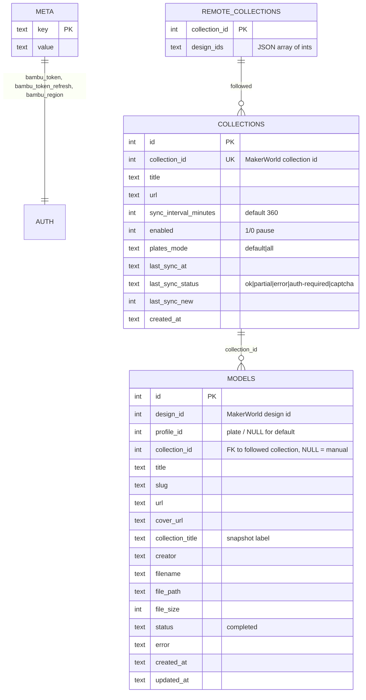

# Data Model & Storage

All persistent state lives in one SQLite file (`data/bambu_downloader.db`,
configurable via `BND_DB_PATH`), opened in **WAL** mode with
`synchronous=NORMAL` and a 30 s busy timeout so the API layer, the scheduler
and the boot-time metadata backfill can share it without "database is locked"
errors. Model files and covers live in the `downloads/` tree; the DB only
points at them.

---

## Entity-relationship overview



---

## Tables

### `meta` — key/value store

Auth and housekeeping state:

| key | contents |
| --- | --- |
| `bambu_token` | Bambu Cloud access token (**stored plaintext** — the DB directory is trusted; optional `BND_API_KEY` protects the API surface) |
| `bambu_token_refresh` | Refresh token; enables silent re-login (see architecture doc, token sequence) |
| `bambu_region` | `global` or `china` → picks `api.bambulab.com` vs `api.bambulab.cn` |
| `meta_scan_at`, `meta_scan_clean` | Metadata-backfill scan watermark (see below) |

### `models` — the library

One row per downloaded `(design_id, profile_id)` pair.

- `profile_id` is the **plate id** from the design's instance list (the
  `#profileId-N` URL fragment refers to this field), **NULL** when a design
  has no plates or was resolved to the default plate.
- `collection_id` links to the followed collection the download came through;
  NULL means a manual, single-URL download.
- `collection_title` is a **snapshot** taken at download time so the Library's
  origin label survives unfollowing or renaming the collection.
- `cover_url` doubles as the `/thumb` lookup key
  (`find_model_path_by_cover`) and drives the backfill scan.

**Dedup constraint** — the important one:

```sql
CREATE UNIQUE INDEX idx_models_design_profile
    ON models(design_id, COALESCE(profile_id, -1));
```

SQLite treats `NULL` as distinct inside a plain `UNIQUE` constraint, so
re-downloading a plate-less design used to insert duplicate rows. The
coalesced index pairs with the upsert clause
`ON CONFLICT(design_id, COALESCE(profile_id, -1))`.

`insert_model`'s conflict clause deliberately updates only
`file_path / file_size / status / error` and **COALESCEs** cover, label and
creator — a re-download must never blank metadata the backfill fetched.

Two read-side dedup helpers exist:

- `model_exists(design_id, profile_id)` — exact pair (URL pinned a plate),
  using `profile_id IS ?` so NULL matches NULL.
- `model_exists_any(design_id)` — design-level (syncs / fragment-less URLs):
  *any* stored plate counts, because those URLs would resolve to the same
  default plate anyway.

### `collections` — followed collections

Registration + sync bookkeeping. `due_collections()` computes eligibility in
SQLite via `julianday()` math:

```sql
WHERE enabled = 1 AND (
    last_sync_at IS NULL
    OR (julianday(?) - julianday(last_sync_at)) * 1440.0 >= sync_interval_minutes
)
```

`record_sync()` stamps `last_sync_at / last_sync_status / last_sync_new` —
writing `last_sync_at` is itself what schedules the next attempt.
`plates_mode` is `default` (first plate per design) or `all` (enumerate every
plate, dedup per design+plate).

### `remote_collections` — own-collection cache

A **cache only**, rewritten wholesale by `refresh_my_collections()` from the
`favorites-collections/tab` endpoint:

- `design_ids` is a JSON array of ints; page-1 embedded ids are topped up from
  the per-collection pager (capped: 100/page, `CAP_MAX_PAGES = 10`).
- Rows are never deleted — a collection that vanishes on MakerWorld just
  disappears from the cache view; nothing here touches `collections`.
- Read paths compute download checkmarks at query time by chunked `IN (...)`
  against the library; `checked_ids` preserves collection order, not sorted.
- Refreshed hourly by the scheduler (deadline backdated from cache age at
  boot, so restarting a fresh container causes **zero** MakerWorld requests)
  or manually via `POST /api/my-collections/refresh`.

---

## On-disk layout

```
data/
  bambu_downloader.db          # main DB (+ -wal, -shm while running)
  backup/
    bambu_downloader.db.bak    # newest snapshot, overwritten on each boot
downloads/
  <collection-slug>/           # subfolder title, slugified
    <designId>-<title>/        # one folder per design
      <filename>.3mf           # the model (name from Bambu / URL)
      cover.webp               # local cover copy for offline /thumb
```

Details:

- Temp files are `.<designId>-<monotonic_ns>.part` inside the destination
  folder and are removed on failure — concurrent downloads can't collide, and
  a crash never leaves a truncated `.3mf` pretending to be complete.
- Disk space is checked before each download (`BND_MIN_FREE_MB`, default
  500 MB; 0 disables) to avoid truncated writes on a full volume.
- Filenames come from the API's `name` hint, the response's
  `Content-Disposition`, or the URL — sanitized through `_safe_filename`.
- `delete_files=true` unfollows sweep model files, `cover.webp` and
  now-empty folders, but every path is resolved and must be
  `is_relative_to` the downloads root before it is touched.

---

## Migrations & backfill

`Database.__init__` is idempotent and runs at every boot:

1. `CREATE TABLE IF NOT EXISTS` for the full schema.
2. A list of `ALTER TABLE` / `CREATE INDEX` statements; "duplicate column"
   errors are treated as already-applied. Covers `cover_url`,
   `collection_title`, `creator`, `plates_mode`, and hot-path indexes
   (`cover`, `created_at DESC`, `collection_id`).
3. Label migration: backfills `models.collection_title` from
   `collections` for rows that pre-date labels (only fills empty values, so
   renamed collections aren't clobbered).

The **metadata backfill** (`DownloadManager.backfill_metadata`, background
task at boot) fills missing `cover_url` / `creator` and recreates missing
`cover.webp` files:

- `NULL` = never checked; `""` = checked, none exists (stored empty so rows
  aren't re-fetched every boot).
- Scan watermark (`meta_scan_at` + `meta_scan_clean`): after a *clean* scan,
  later boots only re-check rows whose `updated_at` moved; a non-empty result
  clears the watermark so the next boot re-verifies fully.
- Anonymous design lookups, one at a time, with the same politeness delay as
  syncs.

---

## Concurrency & integrity

| Concern | Mechanism |
| --- | --- |
| Concurrent writers (API + scheduler + backfill) | WAL journal, `busy_timeout=30000`, per-connection usage, commit/rollback in a context manager |
| Download collisions | `asyncio.Semaphore(2)` + unique `.part` temp names |
| Duplicate rows | Coalesced unique index + upsert (above) |
| Truncated files | Pre-download free-space check + `.part`/rename atomicity |
| Lost last transactions | Accepted: WAL `synchronous=NORMAL` may lose the tail only on host power loss; a re-sync refills everything |
| DB corruption | On-boot online backup via `sqlite3` `.backup()` API (safe with live connections) into `data/backup/` — belt-and-suspenders, not a backup strategy |
| UID mismatch on bind mounts | Startup probe fails fast with `--userns=keep-id` / `podman unshare chown` guidance |

See [`architecture.md`](architecture.md) for the C4 diagrams and
[`operations.md`](operations.md) for deployment and tuning of the intervals
referenced here.