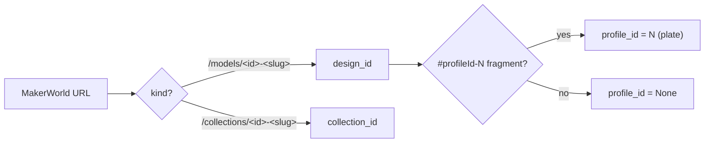
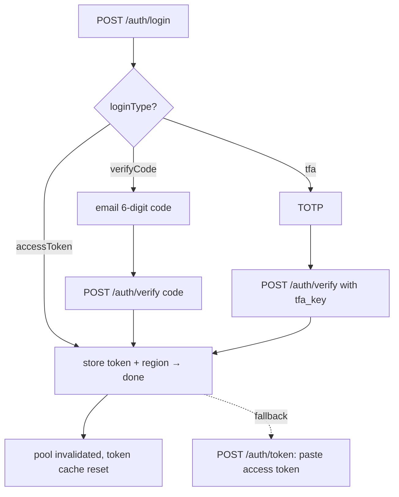
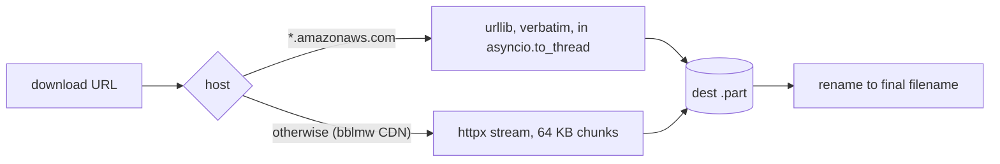

# MakerWorld / Bambu Cloud Integration

How the app talks to MakerWorld and Bambu Cloud: which hosts, which
endpoints, how authentication works, and how the anti-abuse layer is kept
calm. Endpoint behaviour verified against live traffic on **2026-09-11**.

---

## Hosts and their role

| Host | Role | Cloudflare? |
| --- | --- | --- |
| `api.bambulab.com` (or `api.bambulab.cn` for region `china`) | Login, token validation/refresh, per-plate download URLs (`iot-service`) | No — fully open to plain HTTP clients |
| `makerworld.com` `/api/*` JSON gateway | Design/instance metadata, collection listings | No — JSON endpoints are *not* challenged |
| `makerworld.com` HTML pages | — | **Yes** (403 "Just a moment" for curl) — never used |
| `makerworld.bblmw.com` | Cover images (Aliyun OSS); supports `x-oss-process=image/resize,w_N` | CDN; the signed query is the credential |
| `*.amazonaws.com` | Model files via presigned S3 URLs | SigV4: URL must be transmitted verbatim |

Two rules that fall out of this:

1. **Never fetch makerworld.com HTML pages.** Everything goes through JSON
   APIs (`/api/*` on makerworld.com or api.bambulab.com).
2. **Presigned URLs are self-authenticating.** The query string *is* the
   credential — never attach Bearer headers when following a download URL.
   And never let httpx re-encode an S3 URL (see "The S3 signature trap").

---

## Endpoint map

```
Authentication (bambu_api = api.bambulab.com|cn)
  POST {bambu_api}/v1/user-service/user/login            {"account","password"}
       → 200 {"loginType":"verifyCode"}                  → email 6-digit code flow
       → 200 {"loginType":"tfa","tfaKey":...}            → TOTP flow
       → 200 {"accessToken","refreshToken"}              → direct (done)
  POST {bambu_api}/v1/user-service/user/login            {"account","code"}      (email step 2)
  POST {web_origin}/api/sign-in/tfa                       {"tfaKey","tfaCode"}   (TOTP step 2)
       needs CSRF double-submit: GET {web_origin}/api/csrf mints the
       bbl_csrf_token cookie, echoed back in the x-bbl-csrf-token header
  POST {bambu_api}/v1/user-service/user/login             {"refreshToken"}-style → new tokens
  GET  {bambu_api}/v1/design-user-service/my/preference   Bearer → token validation
      ⚠ a 401 now returns an EMPTY body (the old {"code":4} signature is
        gone) — treat ANY 401 on this endpoint as "not signed in".

Designs (mw = makerworld.com)
  GET {mw}/api/v1/design-service/design/{designId}                     (anon ok)
  GET {mw}/api/v1/design-service/design/{designId}/instances           (anon ok)
  GET {mw}/api/v1/design-service/design/{designId}/model               (auth, legacy)
  GET {mw}/api/v1/design-service/instance/{instanceId}/f3mf            (auth, legacy)

Download URL — primary
  GET {bambu_api}/v1/iot-service/api/user/profile/{profileId}?model_id={alphanumericModelId}
      (Bearer) → {"url": signed CDN URL, "name": filename}
      ⚠ model_id is the design payload's ALPHANUMERIC modelId
        (e.g. "US80eb98e276a122"), NOT the numeric design id.
      ⚠ profileId is the instance's profileId field — the same id a
        #profileId-N URL fragment refers to.

Legacy fallbacks — DEAD for newer designs (HTTP 400 when authed, 403 anon);
kept only as fallbacks for old models.

Collections
  GET {mw}/api/v1/design-service/favorites-collections/tab?limit=&offset=   (Bearer)
      → {"total", "hits": [ {id,title,slug,designCnt,isDefault,
                             designs: <embedded page 1, ~100 max>} ]}
  GET {mw}/api/v1/design-service/favorites/{cid}/withoutdesign              (collection meta)
  GET {mw}/api/v1/design-service/favorites/{cid}/designs?limit=100&offset=  (paged items)
```

Privacy semantics worth remembering:

- Design/collection metadata endpoints accept an *optional* Bearer. Garbage
  tokens are ignored for public resources (still 200) but a **valid token is
  required for private ones**. Always attach the stored token for
  user-triggered fetches; only `/api/status` token validation runs without.
- The legacy `/design/{id}/model` and `/instance/{id}/f3mf` endpoints fail
  with 400 for newer designs — the `iot-service` profile endpoint is the
  primary path for everything.

---

## URL parsing



- `parse_model_url` → `(design_id, profile_id | None)`
- `parse_collection_url` → `collection_id`
- Model: `https://makerworld.com/en/models/1023940-the-mobius-flip/#profileId-2`
- Collection: `https://makerworld.com/en/collections/654321-my-favourites`

---

## Auth flows



- **Login flows deliberately use ad-hoc `MakerWorldClient`s** — their CSRF
  cookies must not leak into the pooled identity.
- **Token paste** (`POST /api/auth/token`) is the reliable fallback when the
  login origin is challenged (the web origin *can* captcha `POST
  /api/sign-in/tfa` depending on network; `api.bambulab.com` is not
  challenged).
- **Validation** is tri-state (`True / False / None`): `None` = network
  error and must never be treated as a sign-out.
- **Refresh**: `try_token_refresh()` is guarded by an `asyncio.Lock`
  (concurrent syncs must not stampede), keeps the old tokens on failure (a
  transient 5xx must not force a sign-out), and invalidates the pooled
  clients so the next call carries the new token.
- **Any credential change** (login / verify / token / logout) calls
  `invalidate_shared_clients()`; the lifespan shutdown does too, so sockets
  never outlive the event loop.

---

## Client pooling

`get_client(auth_token, region)` / `release_client(client)` /
`invalidate_shared_clients()` manage a small pool of `httpx.AsyncClient`s
keyed on `(token, region)`:

- Pooled clients are shared across downloads, syncs, backfills and thumbnails
  → warm TLS connections, one polite identity.
- `release_client` keeps pooled clients warm and closes ad-hoc ones; never
  close a client obtained from `get_client` directly.
- Timeouts: connect 30 s, read 120 s (large .3mf streams).

## The S3 signature trap

Presigned S3 URLs compute SigV4 over the **exact query-string bytes**.
httpx normalizes/re-encodes query strings, which breaks the signature →
HTTP 400 `SignatureDoesNotMatch`. Therefore `download_file` routes by host:



- The urllib path is **synchronous** and runs in a worker thread via
  `asyncio.to_thread` so a big transfer can't stall the event loop. (A past
  bug left it `async def` → un-awaited coroutine → silently broken S3
  downloads; it is now sync and regression-guarded.)
- Filename resolution: API `name` hint → `Content-Disposition` → URL tail.

## Thumbnails (CDN resize)

`makerworld.bblmw.com` is Aliyun OSS: appending
`?x-oss-process=image/resize,w_512` turns a 4 MB 1920 px PNG into a ~22 KB
512 px WebP. `/thumb` serves the local `cover.webp` when present (works
offline, ETag/304 supported) and otherwise fetches via this resize param and
persists it next to the model. Format is sniffed from magic bytes
(`RIFF....WEBP` / PNG / else JPEG).

---

## Anti-abuse playbook (HTTP 418 CAPTCHA)

The challenge is tied to the **public IP** and triggered by burst patterns
(~3 req/s observed during syncs). Non-negotiable rules encoded in the app:

1. **Never retry after a 418.** Every extra request deepens the block.
   `CaptchaError` aborts the *whole* sync; partial progress is recorded
   truthfully (`last_sync_status = "captcha"`, `last_sync_new` kept).
2. **Politeness delays**: `BND_DOWNLOAD_DELAY_SECONDS` (default 3 s) between
   downloads, between pagination pages, and between backfill lookups.
3. **Bounded pagination**: page size 100, `CAP_MAX_PAGES = 10` guard, stop on
   empty pages / server-reported totals.
4. **Sequential syncs**: the scheduler syncs one collection at a time; the
   download semaphore caps concurrency at 2.
5. **Backdated refresh deadline**: a restart on a fresh cache issues no
   request at all.
6. The block clears by itself in hours — the UI tells the user to wait
   rather than to poke it.

## Error taxonomy

| Exception | Meaning | Handling |
| --- | --- | --- |
| `MakerWorldError` | Base class | surfaced to activity log / API 400-502 |
| `AuthRequiredError` | Call needs a signed-in account | sync aborts (status `auth-required`); one silent refresh attempt first |
| `AuthExpiredError` | Stored token rejected (subclass of above) | silent refresh, else "please sign in" |
| `ForbiddenError` | Resource gated (purchase/points/region) | 403 with hint about private collections |
| `NotFoundError` | Design/collection missing | 404 |
| `CaptchaError` | 418 / "captcha"/"robot" body markers | abort everything; never retry |

`_detect_captcha` treats **any** 418 as a challenge and also checks error
bodies for `captcha`/`robot` text, since the challenge leaks into non-418
responses occasionally.

---

## Region support

`bambu_region` meta (`global` | `china`) selects
`api.bambulab.com` vs `api.bambulab.cn` for auth and download-URL endpoints;
makerworld.com endpoints are region-independent.

Related docs: [`architecture.md`](architecture.md) (C4 views),
[`data-model.md`](data-model.md) (cache tables),
[`operations.md`](operations.md) (config reference).