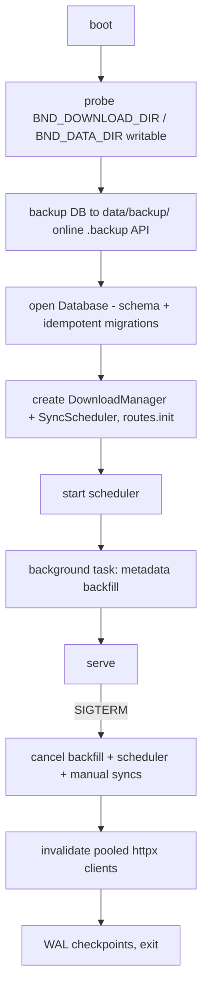

# Operations Guide

Running, configuring, and observing the Bambu Downloader container. For the
architecture picture see [`architecture.md`](architecture.md) (C4 models),
for storage details [`data-model.md`](data-model.md).

---

## Deployment

### Container image

`Dockerfile` (python:3.13-slim): deps layer → `app/` → unprivileged user with
build-time-configurable UID (`--build-arg BND_UID=$(id -u)` for rootless
podman) → volumes `/app/downloads`, `/app/data` → `HEALTHCHECK` pinging
`/api/status`.

Uvicorn runs as PID 1 with `--timeout-graceful-shutdown 15`: it traps
SIGTERM/SIGINT itself (clean `podman stop`), drains connections, and runs the
lifespan shutdown (scheduler cancel, WAL checkpoint, pooled-socket release).
A `bash wait` reporting exit 143 after `podman stop` is normal.

### Rootless podman

`compose` sets `userns_mode: keep-id` so the host user appears inside the
container and bind mounts stay writable. Without it you get
"attempt to write a readonly database". Alternatives:
`podman unshare chown -R 1000:1000 ./data ./downloads`.

The app **fails fast at startup** if a volume isn't writable
(`_probe_writable`), with those exact commands in the error message.

```bash
podman compose up -d --build   # or: podman build -t bambu-downloader . && podman run …
```

### Lifecycle (lifespan hook, `app/main.py`)



---

## Configuration reference

Every setting is an optional `BND_*` environment variable (captured at
import time in `app/config.py`).

### Paths & network

| Variable | Default | Meaning |
| --- | --- | --- |
| `BND_DOWNLOAD_DIR` | `/app/downloads` | Model archive root |
| `BND_DATA_DIR` | `/app/data` | DB + backup directory |
| `BND_DB_PATH` | `<data_dir>/bambu_downloader.db` | SQLite file |
| `BND_PORT` | `8080` | Listen port |

### Endpoints & identity

| Variable | Default | Meaning |
| --- | --- | --- |
| `BND_BAMBU_API_BASE` | `https://api.bambulab.com` | Global Bambu Cloud API |
| `BND_BAMBU_API_BASE_CN` | `https://api.bambulab.cn` | China region API |
| `BND_MAKERWORLD_BASE` | `https://makerworld.com` | JSON gateway + CDN URLs |
| `BND_USER_AGENT` | `bambu-downloader/0.1 (personal archiver)` | Honest UA, no browser spoofing |

### Sync & anti-abuse tuning

| Variable | Default | Meaning |
| --- | --- | --- |
| `BND_SYNC_INTERVAL_MINUTES` | `360` | Default interval for newly followed collections |
| `BND_SCHEDULER_INTERVAL_SECONDS` | `300` (floor 15) | How often the scheduler wakes to check due collections |
| `BND_DOWNLOAD_DELAY_SECONDS` | `3` | Gap between downloads / paging / backfill requests — the main anti-418 lever (0 disables) |
| `BND_MY_COLLECTIONS_REFRESH_MINUTES` | `60` (floor 15) | Own-collections cache refresh cadence |

### Safety & security

| Variable | Default | Meaning |
| --- | --- | --- |
| `BND_MIN_FREE_MB` | `500` (0 disables) | Refuse downloads below this free space |
| `BND_BACKUP_ON_BOOT` | `1` | Snapshot DB to `data/backup/` before anything runs |
| `BND_API_KEY` | empty (open) | When set, every `/api/*` request needs `X-API-Key` (constant-time compare). Recommended on shared networks. |

The token is stored **plaintext** in the DB `meta` table — treat `data/` as
sensitive; the API-key gate exists because of this.

---

## API surface (summary)

| Method & path | Purpose |
| --- | --- |
| `GET /api/status` | Scheduler state, in-flight syncs, queue snapshot, token validity (tri-state) |
| `POST /api/auth/login` / `verify` / `token` / `logout` | Account flows (password → email code / TOTP; token paste fallback) |
| `POST /api/download`, `POST /api/resolve` | Download a URL / preview metadata+plates |
| `GET /api/models`, `/api/model-labels`, `/api/events` | Library grid, origin-label filter bar, activity ring buffer |
| `GET /api/collections`, `POST /api/collections`, `PATCH/DELETE /api/collections/{id}` | Follow / configure / unfollow (optional file deletion) |
| `POST /api/collections/{id}/sync` | Manual sync now (background task; `{"started": bool}`) |
| `GET /api/my-collections`, `POST /api/my-collections/refresh` | Own-collection cache + manual refresh (429 on captcha) |
| `GET /api/shared-model` | PWA share-target URL validation |
| `GET /thumb?url=…` | Cover proxy (ETag/304, host-allowlisted, w clamped 64–1920) |
| `/`, `/static/*`, `/manifest.webmanifest`, `/sw.js`, `/favicon.ico` | PWA shell |

Security headers: strict CSP on the shell (`script-src 'self'`), nosniff,
no-referrer; the shell and `/sw.js` are served `no-store` so UI updates land.

---

## Observing & troubleshooting

| Symptom | Cause / fix |
| --- | --- |
| "attempt to write a readonly database" at boot | Bind-mount UID mismatch → `userns_mode: keep-id` or `podman unshare chown -R 1000:1000 ./data ./downloads` |
| Sync status `captcha` | MakerWorld 418 for this IP — wait hours, **don't retry**; raise `BND_DOWNLOAD_DELAY_SECONDS` |
| Sync status `auth-required` | Token expired and refresh failed → re-login (or paste token) in Settings |
| Library covers missing | Backfill fills them on next boot; empty `""` values mean "checked, none exists" |
| Container exits at startup with writability error | Read the message — it names the volume and the exact podman commands |
| Stale UI after update | Hard-refresh; the service worker uses a versioned cache (bump `CACHE_VERSION` in `app/static/sw.js` when the shell changes) |
| Healthcheck failing | Container's `/api/status` didn't return 200 within 4 s — check logs |

Activity events (downloads, syncs, errors, token refreshes) are exposed at
`GET /api/events` and shown in the UI's Activity tab — the primary runtime
log for the archive.

## Tests

`tests/` (pytest + pytest-asyncio, `asyncio_mode=auto`) is fully offline:
temp DBs, `httpx.MockTransport`, faked pooled clients. 90 passing tests cover
dedup, sync aborts, thumbnails/ETags, auth flows and scheduler behaviour.

Run them with the dev requirements installed:

```bash
pip install -r requirements-dev.txt && pytest
```

Related docs: [`architecture.md`](architecture.md),
[`data-model.md`](data-model.md),
[`makerworld-integration.md`](makerworld-integration.md).